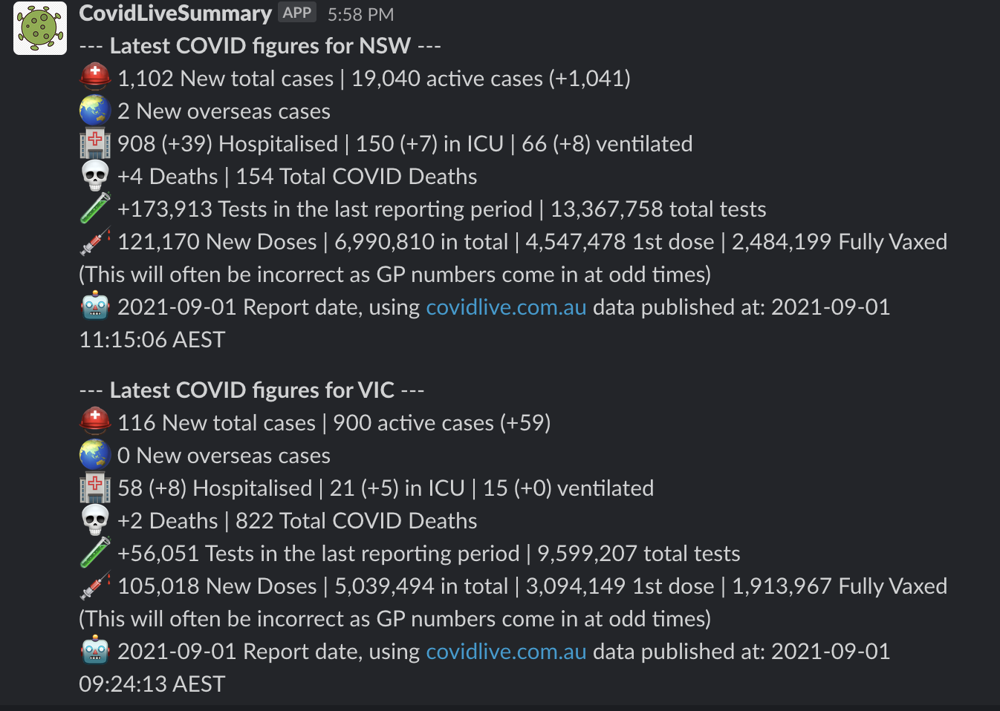

# CovidLive AU Summary Slackbot

This bot is a very simple slackbot that pulls data, summarises and posts up to date AU COVID stats to a provided slack channel. Sourcing data from https://covidlive.com.au




## Install
Assuming you have [virtualenv](https://github.com/pypa/virtualenv) and [pip](https://github.com/pypa/pip) installed the below will setup the requirements.
```
virtualenv venv --version 3.7
source venv/bin/activate
pip3 install -r requirements.txt
```

## Slack Setup
Follow this [slack tutorial](https://github.com/slackapi/python-slack-sdk/blob/main/tutorial/01-creating-the-slack-app.md) to setup a new slack app
Make sure you note down the name of your bot, and your OAuth token, they will need to be set as env vars below.
Once you have your bot create a new slack channel (note the name down for below)
type `/invite @<MyBotName>`  into the channel you wish to add the bot to

## Bot Setup
A number of env vars need to be setup whereever you plan to run the bot
```
export SELECTED_CODES="VIC,NSW,QLD,NT,SA,ACT,WA,TAS,AUS" 
export SLACK_CHANNEL_NAME="#<MyChannelNameHere>" 
export SLACK_BOT_TOKEN="Slack OAuthTokenHere" 
export SLACK_BOT_NAME="Slack Bot Name here" 
```

## Run me
```shell
# Locally
python3 post_covid_stats.py

# docker run dockerhub image
docker run \
    -e "SELECTED_CODES=VIC,NSW" \
    -e "SLACK_BOT_TOKEN=$SLACK_BOT_TOKEN" \
    -e "SLACK_CHANNEL_NAME=$SLACK_CHANNEL_NAME" \
    -e "SLACK_BOT_NAME=$SLACK_BOT_NAME" \
    boycey/covidliveslackbot:latest

# docker run self built image
docker run \
    -e "SELECTED_CODES=VIC,NSW" \
    -e "SLACK_BOT_TOKEN=$SLACK_BOT_TOKEN" \
    -e "SLACK_CHANNEL_NAME=$SLACK_CHANNEL_NAME" \
    -e "SLACK_BOT_NAME=$SLACK_BOT_NAME" \
    covidliveslackbot:latest
```

## Build new image
```
docker build -t covidliveslackbot:latest .
```

